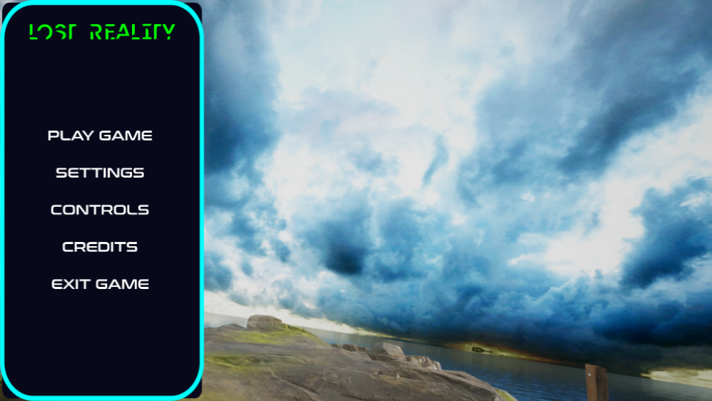
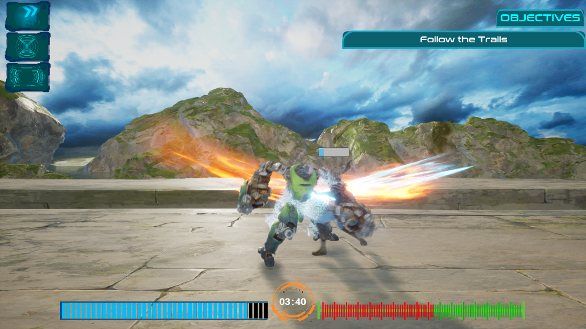
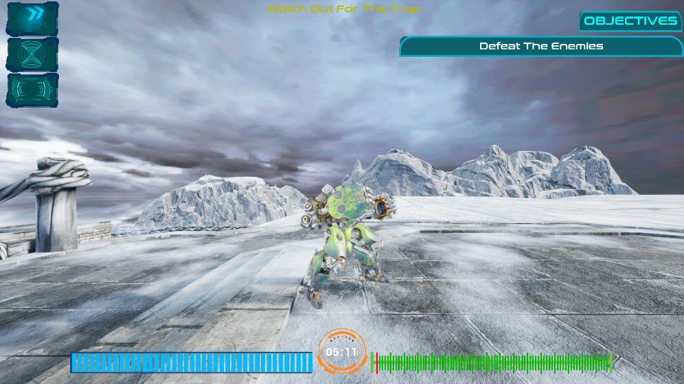

# Lost-Reality-2D-Platforming
Project Penulisan Ilmiah

Tahun Pembuatan : 2020

Final Build

https://drive.google.com/file/d/1e398NLorJZJXGh9gHP7Erxjwi7CyjkwV/view?usp=sharing

## Preview

## Copyright Disclaimer
Penggunaan Aset di atas bertujuan hanya untuk pendidikan, riset , dan personal tidak bertujuan untuk komersil

Copyright Disclaimer under Section 107 of the copyright act 1976, allowance is made for fair use for purposes such as criticism, comment, news reporting, scholarship, and research. Fair use is a use permitted by copyright statute that might otherwise be infringing. Non-profit, educational or personal use tips the balance in favour of fair use.
