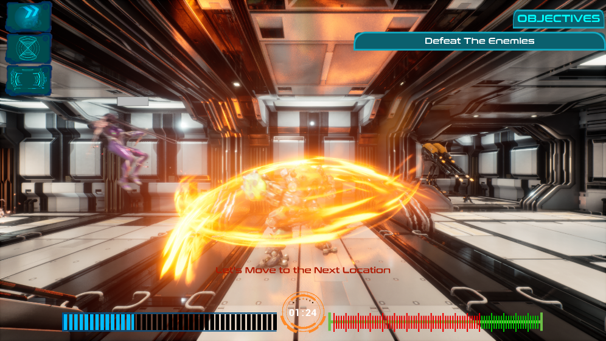

# Lost Reality 2D
Genre : 2D, Action, Side Scroller, Platformer

Game Engine : Unreal Engine 4 Version 4.24.3

Project Penulisan Ilmiah

Production Year : 2020

Final Build

https://drive.google.com/file/d/1e398NLorJZJXGh9gHP7Erxjwi7CyjkwV/view?usp=sharing

## Preview

## Copyright Disclaimer
Penggunaan Aset pada proyek tersebut bertujuan hanya untuk pendidikan, riset, dan personal tidak bertujuan untuk komersil

The use of the assets in the project is for educational, research and personal purposes only, not for commercial
